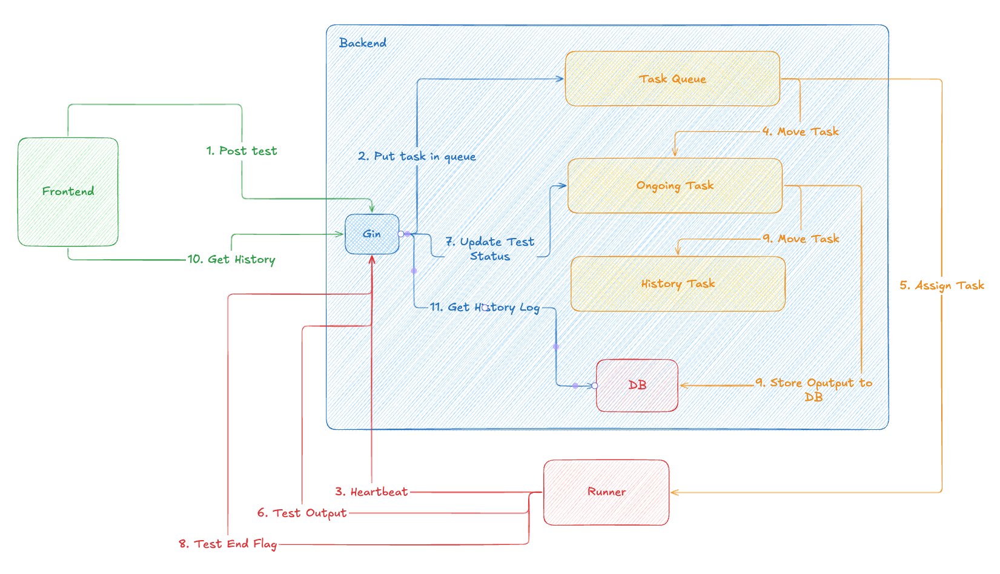
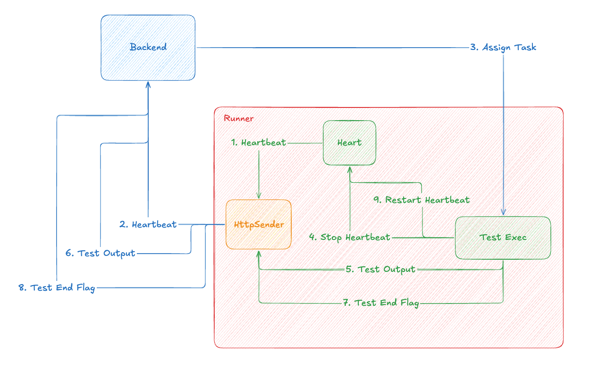

# free5GC Integration Test System

A free5GC developer friendly integration test system.

## System Environment

| DevOpts | Version |
| - | - |
| OS | Ubuntu 25.04 |
| go | 1.25.5 |
| nodejs | v20.20.0 |
| yarn | 1.22.22 |

## Make

- Backend and Frontend

    ```bash
    make
    ```

    This will build the backend binary executable file and frontend resource under `build` directory.

- Backend only

    ```bash
    make backend
    ```

- Frontend only

    ```bash
    make frontend
    ```

- Run

    Setup the configuration file: [config.yaml](./config.yaml)

    ```bash
    make run
    ```

- Lint

    ```bash
    make lint
    ```

- Test

    ```bash
    make test
    ```

## API Level

```text
/api
    └─/login(POST)
    └─/logout(POST)
    └─/test
    │   └─/testcase(GET)
    │   └─/tasks(GET)
    │   └─/task(GET, POST, DELETE)
    └─/github(GET)
    └─/runner(GET)
    └─/admin
    │   └─/test
    │   │  └─/testcase(POST, DELETE)
    │   │  └─/history(DELETE)
    │   └─/runner(POST, DELETE)
    └─/run
        └─/runner
            └─/heartbeat(POST)
            └─/test-output(POST)
```

- [Postman](./free5gc-it-system.postman_collection.json)
- [Openapi]

## WorkFlow Flow

### Test Flow



### Runner Flow


